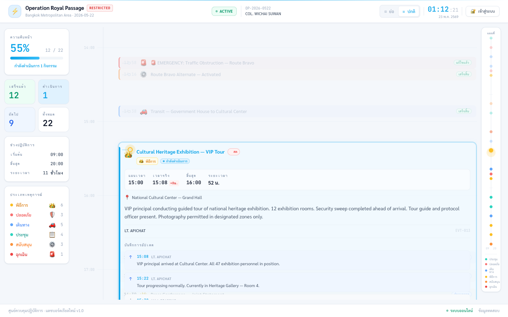
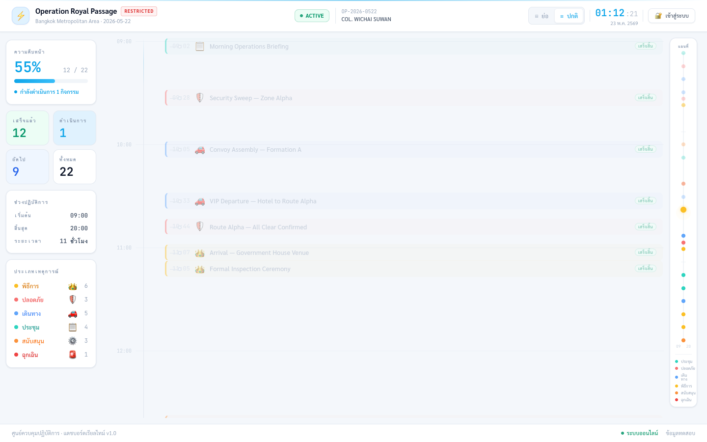
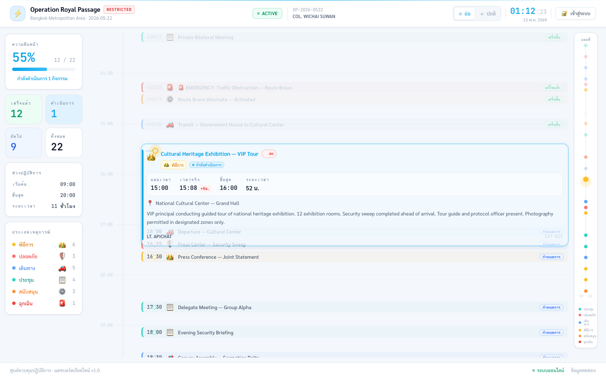
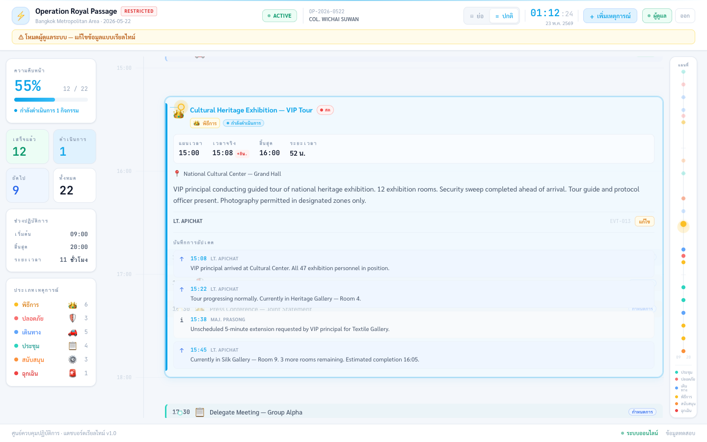
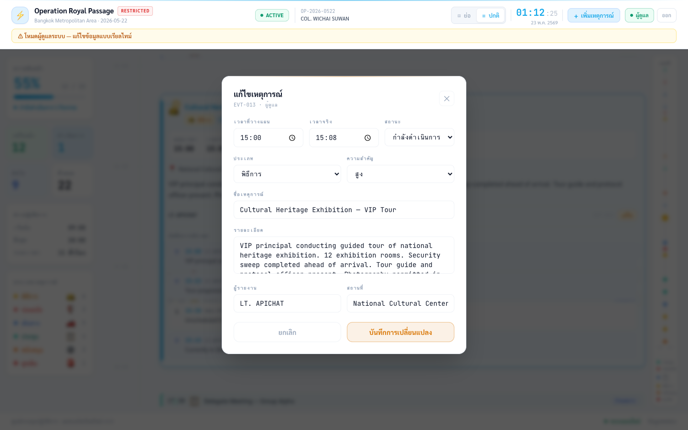

# Operation Timeline

แดชบอร์ดควบคุมปฏิบัติการแบบเรียลไทม์ สร้างด้วย React + Tailwind CSS  
แสดง timeline เหตุการณ์ตามเวลาจริง พร้อมระบบผู้ดูแลสำหรับเพิ่ม/แก้ไขข้อมูล



---

## Features

### Timeline
- **Time-accurate positioning** — เหตุการณ์วางตำแหน่งบน timeline ตาม pixel-per-minute จริง (compact: 2px/min, normal: 3.5px/min)
- **Auto-scroll to active** — โหลดหน้าแล้ว scroll ไปยัง event ที่กำลัง active อัตโนมัติ
- **NOW indicator** — เส้นแดง + timestamp แสดงเวลาปัจจุบัน อัปเดตทุก 5 วินาที
- **No-overlap layout** — expanded card คำนวณ cumulative offset ดัน siblings ลงโดยไม่ overlap

### Event Cards — 3 states
| State | Trigger | การแสดงผล |
|-------|---------|-----------|
| **Compact** | past / upcoming | Single row, faded (past: opacity 45%) |
| **Semi-expanded** | upcoming-near (normal mode) | 2-line card พร้อม amber pulse |
| **Expanded** | active / click | Full detail, time strip, location, logs |

### Density Modes
- **ปกติ** — 3.5px/min, แสดง logs, semi-expanded cards, padding เต็ม
- **ย่อ** — 2px/min, ซ่อน logs, ซ่อน semi-expand, timeline หนาแน่นขึ้น ~2×

### Admin Mode
- เพิ่มเหตุการณ์ใหม่ผ่าน modal form
- แก้ไขเหตุการณ์ที่มีอยู่ (pre-populated form + actual_time + status update)
- ปุ่ม แก้ไข แสดงเฉพาะเมื่อ admin mode เปิดอยู่

### Sidebar & MiniMap
- Stats: ความคืบหน้า %, เสร็จแล้ว, ดำเนินการ, ถัดไป, ทั้งหมด
- ช่วงปฏิบัติการ, นับจำนวน event ตามประเภท
- MiniMap: spine สั้น + dot แต่ละ event + NOW tick คลิกเพื่อ scroll ไป

---

## Tech Stack

| Layer | เครื่องมือ |
|-------|-----------|
| UI Framework | React 18 |
| Build Tool | Vite 4 |
| Styling | Tailwind CSS 3 (light theme, custom design tokens) |
| Font | Sarabun (Thai) + JetBrains Mono |
| State | React Context (AppContext) |
| Icons/Type | Emoji-based type icons |

---

## Getting Started

```bash
# Install dependencies
npm install

# Start dev server
npm run dev
# → http://localhost:5173

# Build for production
npm run build
```

---

## Project Structure

```
src/
├── components/
│   ├── admin/
│   │   ├── AddEventModal.jsx     # Modal เพิ่ม event ใหม่
│   │   ├── EditEventModal.jsx    # Modal แก้ไข event (pre-populated)
│   │   └── LoginButton.jsx       # Toggle admin mode
│   ├── events/
│   │   ├── EventCard.jsx         # Compact / SemiExpanded / Expanded cards
│   │   └── EventLogs.jsx         # Update log entries
│   ├── layout/
│   │   ├── Header.jsx            # Live clock, density toggle, admin controls
│   │   └── Sidebar.jsx           # Stats, progress, event type breakdown
│   ├── timeline/
│   │   ├── Timeline.jsx          # Main canvas, overlap layout, NOW line
│   │   └── MiniMap.jsx           # Scrollable minimap sidebar
│   └── ui/
│       ├── StatusBadge.jsx
│       └── TypeIcon.jsx
├── context/
│   └── AppContext.jsx            # events, densityMode, expandedEvents, admin
├── data/
│   ├── mockEvents.js             # 22 mock events (09:00–20:00)
│   └── mockLogs.js               # Update logs per event
├── hooks/
│   └── useCurrentTime.js
└── utils/
    ├── timeUtils.js              # toPx, getEventState, DAY_START/END
    └── statusUtils.js            # TYPE_CONFIG, STATUS_CONFIG
```

---

## Event States

```js
// getEventState(event, currentTime) returns:
'active'         // status === 'active'
'upcoming-near'  // within 30 minutes of planned_time
'upcoming'       // future event
'past'           // status === 'completed' | 'resolved'
```

## Event Types

| Type | สี | ไอคอน |
|------|----|-------|
| briefing | Teal | 📋 |
| security | Red | 🛡 |
| movement | Blue | 🚗 |
| ceremony | Amber | 🎖 |
| logistics | Orange | ⚙️ |
| emergency | Red (bright) | 🚨 |

---

## Screenshots

| | |
|---|---|
|  |  |
| ช่วงเช้า — past events compact | Compact mode |
|  |  |
| Admin mode | Edit event modal |
